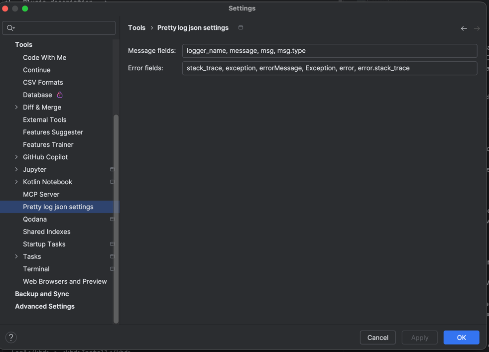
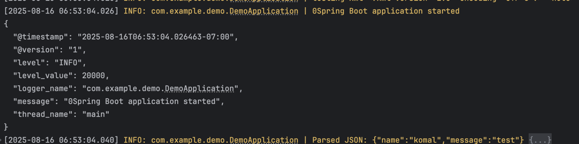
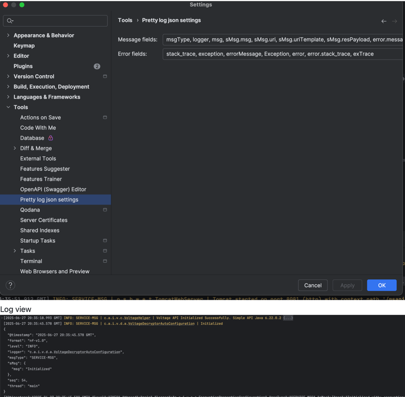
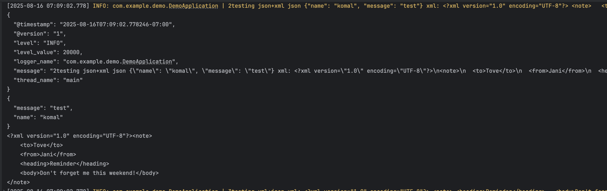
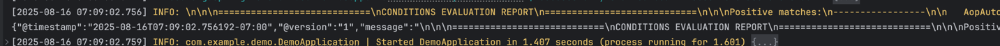

#  Pretty JSON Log plugin

<!-- Plugin description -->
Pretty JSON Log plugin for IntelliJ Platform makes NDJSON (Newline Delimited JSON a.k.a. JSON Lines) logs more readable
in the console. It has the following features:

- **JSON Parsing**: Automatically parses each log line as JSON and extracts essential log information such as timestamp,
  log level, and message.
- **Colorful Display**: Displays essential log information in different colors depending on the log level to make it
  easier to read.
- **Readable Timestamp**: Formats the timestamp in a human-friendly format.
- **Expandable Pretty JSON**: Prints a well-formatted JSON string following the log message. The JSON string is folded
  by default, but you can expand it when you need to view the full details.
- **Seamless Integration**: Supports various log formats such
  as [Logstash](https://github.com/logfellow/logstash-logback-encoder), [Bunyan](https://github.com/trentm/node-bunyan),
  [Pino](https://github.com/pinojs/pino), [log/slog](https://pkg.go.dev/log/slog),
  [Cloud Logging](https://cloud.google.com/logging/docs/structured-logging), etc. with no additional configuration or
  software.
- **AppSettings to select custom fields**: Will parse out the selected log json fields and display them in the log view, so you can easily see the important
  information without having to expand the JSON. 
- **Nested fields**: you can configure to display the nested fields in Log view (e.g sMsg.msg below). 
- **Json/Xml in json values**: if the selected log json fields contain strings containing valid JSON or xml, it will also pretty print those
  in the collapsed log view.
- **Handle large logs**: if the log message is too large, its unable to pretty print but it will try to parse json with just text match partially, so you can still see the
  important information without having to expand the JSON.

This plugin is useful when you are developing a modern system that outputs logs in JSON format. You no longer need to
switch log formats between production and local development environments.
<!-- Plugin description end -->

## Installation

- Using the IDE built-in plugin system:

  <kbd>Settings/Preferences</kbd> > <kbd>Plugins</kbd> > <kbd>Marketplace</kbd> > <kbd>Search for "Pretty JSON
  Log"</kbd> > <kbd>Install</kbd>

  

- Manually:

  Download the [latest release](https://github.com/orangain/pretty-json-log-plugin/releases/latest) and install it
  manually using
  <kbd>Settings/Preferences</kbd> > <kbd>Plugins</kbd> > <kbd>⚙️</kbd> > <kbd>Install plugin from disk...</kbd>

After installation, newly written JSON lines logs in the console will be automatically formatted by the plugin.

## Limitations

JetBrains IDEs provide different kinds of consoles for different run configurations, but this plugin does not currently
support all consoles due
to [the lack of extension points in the IDE](https://youtrack.jetbrains.com/issue/IJPL-60196/TerminalExecutionConsole-Extension-points-support).
If the console does not have the context menu item "Pretty JSON Log", the plugin is not supported in that console.

## How to configure log colors

You can configure log colors from the <kbd>Settings</kbd> > <kbd>Editor</kbd> > <kbd>Color Scheme</kbd> > <kbd>Console
Colors</kbd> > <kbd>Log console</kbd>.

## How to see the debug log of the plugin

1. <kbd>Help</kbd> > <kbd>Diagnostic Tools</kbd> > <kbd>Debug Log Settings...</kbd>.
2. Add line `#io.github.orangain.prettyjsonlog` to the text area of the dialog and click <kbd>OK</kbd>.
3. Reproduce the issue.
4. <kbd>Help</kbd> > <kbd>Show Log in Finder/Explorer</kbd> to open the log directory.
5. Open the `idea.log` file and find the log of the plugin by searching for `#io.github.orangain.prettyjsonlog`.

Enabling debug logging may slow down the IDE, so it is recommended to disable it after reproducing the issue.

## Acknowledgements

This plugin is inspired by the [pino-pretty](https://github.com/pinojs/pino-pretty)
and [bunyan CLI](https://github.com/trentm/node-bunyan). The great idea behind these tools is that applications should
write logs in machine-readable format (JSON) and pretty-printing for human readability should be done by another tool. I
am grateful to the authors of these tools.

Thanks to the [IntelliJ Platform Plugin Template][template], I was able to quickly start developing the plugin.

[template]: https://github.com/JetBrains/intellij-platform-plugin-template

[docs:plugin-description]: https://plugins.jetbrains.com/docs/intellij/plugin-user-experience.html#plugin-description-and-presentation

## Internal

### How to release

1. Update `pluginVersion` in `gradle.properties` and merge it into the main branch.
2. Publish a release note with the new version.
3. Approve deployment.
4. The new version will be reviewed by JetBrains and if there are no problems, it will be published in Marketplace.
